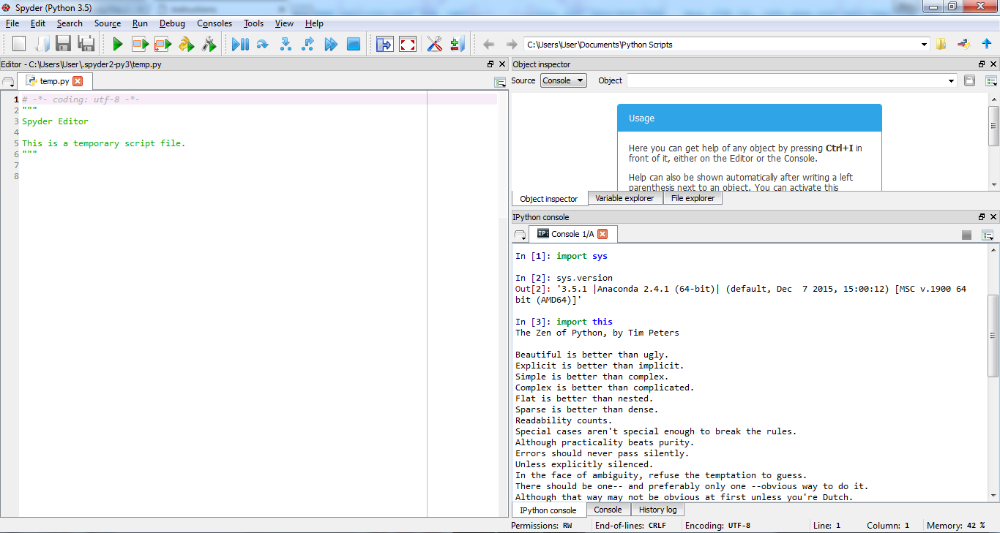

UECM3033 Assignment #1 Report
========================================================

- Prepared by: Foo Ngai Zheng
- Tutorial Group: T3

--------------------------------------------------------

## Task 1 -- setup a github repository

The reports, codes and supporting documents are uploaded to Github at: 

[https://github.com/AlferdFoo/UECM3033_assign1](https://github.com/AlferdFoo/UECM3033_assign1)

---------------------------------------------------------

## Task 2 -- setup python

Put here the screen shot of file (python.png)

------------------------------------------------------------

## Task 3 -- modify and run Python script

1. Hexadecimal representation of 13000981 is 0xc66115

2. $$\int_0^frac{\pi}2 4 \cos x \sin x \e^{2 \cos x +1} \, dx = \e + \e^3

3. System of 10 linear equation:

\begin{align*}
3 x_0 + 2 x_1 &= 7,\\
5 x_0 + x_4 &= 10,\\
x_1 + 10 x_2 &= 32,\\
9 x_2 + 8 x_5 &= 75,\\
3 x_3 + 6 x_4 &= 42,\\
4 x_3 + 8 x_7 &= 80,\\
2 x_5 + x_9 &= 22,\\
4 x_6 + 5 x_8 &= 73,\\
10 x_6 + 2 x_9 &= 90,\\
7 x_7 + 9 x_8 &= 137.
\end{align*}

Solution = [ 1. 2. 3. 4. 5. 6. 7. 8. 9. 10. ]

-----------------------------------

last modified: 28/01/2016
